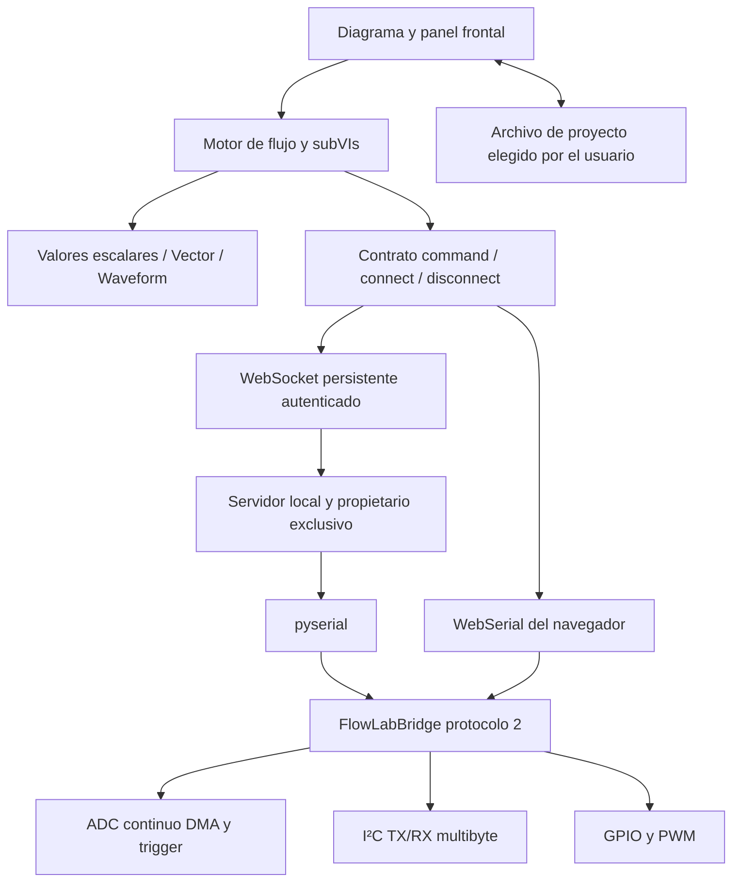

# FlowLab 0.2: transporte persistente, adquisición por lotes y módulos

Esta revisión modifica el editor, motor, servidor y firmware. Mantiene panel frontal, diagrama de bloques y proyectos JSON de la versión 0.1; añade 12 tipos de bloque, para un total de 70. El código es MIT. No proporciona compatibilidad con archivos VI de National Instruments.

## 1. Separación de responsabilidades



El navegador decide qué operaciones ejecutar; el periférico ADC del ESP32 decide cuándo muestrear durante una captura. El reloj del diagrama, el reloj de adquisición y la llegada de datos al PC son magnitudes distintas. HTTP queda para cargar la aplicación, descubrir puertos, consultar estado y gestionar compilaciones. El bucle de adquisición ya no realiza peticiones HTTP por muestra.

| Problema original | Implementación 0.2 | Archivos principales |
|---|---|---|
| Polling HTTP | Canal WebSocket con IDs, errores, límites y propiedad de sesión | `web/transports.mjs`, `ws_service.py`, `server.py` |
| ADC lento | Captura finita mediante ADC continuo/DMA; trigger y pretrigger | `firmware/FlowLabBridge/burst.h` |
| Solo escalares | Vector y Waveform con validación y procesamiento por lote | `web/data.mjs`, `web/core.mjs` |
| Lienzo saturado | Subdiagramas embebidos, navegación y estado por instancia | `web/core.mjs`, `web/app.mjs`, `web/codegen.mjs` |
| Solo localStorage | Archivos elegidos explícitamente, escritura transaccional y conflictos | `web/project-store.mjs` |
| I²C de un byte | Comando TX/RX de hasta 32 bytes por dirección | `web/serial-protocol.mjs`, firmware y servidor |
| Serie requiere Python | Transporte WebSerial con el mismo protocolo | `web/transports.mjs`, `scripts/serve-webserial.mjs` |

## 2. WebSocket y propiedad del dispositivo

Al iniciar, el servidor abre un puerto WebSocket libre en `127.0.0.1` y anuncia su URL en `/api/status`. El HTML incorpora el token aleatorio de esa ejecución del servidor. Solo se admiten los orígenes HTTP locales del puerto correspondiente; el primer mensaje debe autenticar la sesión. No se coloca el token en la URL ni se guarda en el navegador.

```json
{"id":1,"op":"auth","args":{"token":"TOKEN_DE_LA_SESION"}}
{"id":2,"op":"command","args":{"command":"adc","args":{"pin":34,"mode":"raw"}}}
```

Respuesta: `{"id":2,"ok":true,"value":2048}` o `{"id":2,"ok":false,"error":"…"}`. Los IDs son crecientes por conexión; un ID repetido no vuelve a ejecutar una escritura. La correlación por ID impide confundir respuestas tardías. No se reintentan automáticamente comandos físicos: una respuesta perdida no demuestra que la escritura no ocurrió.

Solo una sesión WebSocket puede poseer el puente. Las mutaciones HTTP antiguas también deben adquirir el mismo bloqueo. Al cerrar el transporte se intenta detener y cerrar el puerto. El firmware conserva su watchdog de 2 s para GPIO/PWM; el ping WebSocket detecta problemas del canal de red, pero no sustituye ese watchdog.

Límites: 8 solicitudes pendientes en el cliente, 256 KiB de cola de envío del navegador, mensajes entrantes de servidor de hasta 64 KiB y cola WebSocket acotada. El motor solo ejecuta un ciclo a la vez y espera cada operación serie. Un timeout de transporte cierra la conexión y exige reconexión explícita. No existe una cola ilimitada de capturas detrás de una interfaz lenta.

Este diseño elimina el coste de crear/intercambiar una solicitud HTTP por comando. No garantiza una latencia determinada ni convierte Windows en tiempo real. El servidor actual procesa comandos serie secuencialmente; no incorpora eventos espontáneos del firmware ni streaming continuo sin huecos. La consulta periódica de compilación se conserva porque no participa en la adquisición.

## 3. ADC por ráfaga y disparo

El nuevo bloque **ESP32 · ADC ráfaga DMA** solicita una captura de un único canal ADC1. El driver `adc_continuous` llena buffers DMA independientemente del navegador. El firmware consume esos buffers, busca el disparo y conserva el lote en RAM. Transfiere JSON por USB/UART después de detener el ADC.

| Parámetro | Contrato |
|---|---|
| `pin` | GPIO ADC1 permitido por el perfil de la familia |
| `rate` | 20 000–80 000 muestras/s solicitadas; el driver puede rechazar configuraciones |
| `count` | 16–4096 muestras por captura |
| `trigger` | `immediate`, `rising` o `falling` |
| `level` | Umbral 0–4095 en cuentas ADC normalizadas a 12 bits |
| `pre` | 0 a `count-1` muestras anteriores al cruce; debe ser 0 en inmediato |
| `timeout` | 100–5000 ms para completar disparo y captura |

El flanco ascendente requiere `anterior < level && actual >= level`; el descendente, `anterior > level && actual <= level`. Solo se acepta un disparo cuando ya existen suficientes muestras previas. Se conservan exactamente `pre` muestras anteriores y el punto de cruce ocupa el índice `pre`. Si no se completa el lote a tiempo, falla toda la operación; no se devuelve una waveform parcial como si estuviera completa.

Memoria del firmware: dos arreglos de 4096 enteros de 16 bits, pool DMA de 16 KiB y frame de lectura de 512 bytes. Un overflow de DMA invalida la captura. Las APIs oneshot de Arduino se liberan antes de reservar ADC continuo. El firmware apunta a Arduino-ESP32 3.3.5, con formato DMA condicionado por familia y normalización del ancho ADC del S2.

La salida incluye `dt=1/rate`, `t0=-pre/rate`, `seq`, `triggerIndex`, `deviceStartUs`, `unit`, `clock` y `rateNominal:true`. `deviceStartUs` es una marca aproximada posterior al arranque del driver, no el timestamp exacto de la primera conversión. `t0` es relativo al disparo; no es UTC. La frecuencia efectiva debe medirse en cada placa. No se presenta el valor nominal como calibración o medición certificada.

**Presupuesto de rendimiento:** a 20 kS/s, 4096 muestras ocupan 204,8 ms de adquisición. Con valores de cuatro dígitos, el JSON ocupa aproximadamente 20 KiB; a 115200 baudios, 8N1, transferirlo requiere aproximadamente 1,8 s, además del disparo y otros costes. No se pueden sostener 20 kS/s hacia el PC con este formato/enlace. La mejora permite resolver un transitorio dentro de cada ráfaga, con huecos entre ellas. Para streaming continuo harían falta frames binarios, mayor caudal y un buffer circular con gestión explícita de pérdidas.

Las ráfagas no admiten salidas GPIO/PWM armadas. El validador impide mezclarlas con otras operaciones ADC y con bloques de escritura/I²C multibyte en el mismo grafo. El firmware también comprueba `armed`, independientemente de la interfaz. **Detener** espera la operación pendiente; no es una cancelación DMA instantánea. El timeout serie de ráfaga es 12 s, incluyendo transferencia; WebSocket permite 15 s. La simulación genera una señal sintética de 1 kHz y no demuestra comportamiento físico del trigger ni precisión ADC.

## 4. Vector y Waveform

```javascript
const vector = [0.2, 0.4, 0.1];
const waveform = {
  kind: 'waveform', samples: vector,
  dt: 0.00005, t0: -0.00005,
  seq: 1, triggerIndex: 1, unit: 'V'
};
```

Vector admite hasta 4096 números finitos. Waveform añade intervalo uniforme positivo y origen temporal finito. No hay conversión implícita a escalar: usa **Extraer muestras**, **Estadística de vector** o **Índice de vector**. Los cables vectoriales son violetas y los waveform, cian, ambos más gruesos que los escalares.

Bloques nuevos: Vector numérico, Construir waveform, Extraer muestras, Escalar waveform, Estadística de vector —media/RMS/mínimo/máximo—, Índice de vector y Gráfico de waveform. Escalar preserva `dt`, `t0` y metadatos. El gráfico usa `t0+i*dt`; no asigna a las muestras el período del editor. Guarda en pantalla el último lote completo. **↓ Waveform** exporta el lote como JSON, separado del CSV escalar. No hay archivo histórico automático de todas las ráfagas.

## 5. SubVIs

Un nodo `subvi` contiene su propio proyecto `graph`, con un terminal `subInput` y un terminal `subOutput`. Su interfaz tiene una entrada y una salida configurables con cualquiera de los seis tipos. La validación comprueba firma, conexiones, ciclos, parámetros, profundidad y recursos físicos incluso dentro de módulos.

Cada instancia crea un `Runtime` hijo con memoria propia. Duplicar un subVI copia su definición; no comparte integradores ni filtros con el original. El motor padre pasa el mismo tiempo y `dt` a sus hijos. La cancelación se propaga a todos los descendientes. El uso repetido de un GPIO por módulos distintos se detecta antes de ejecutar hardware.

En el inspector pulsa **Abrir subdiagrama**; edita sus bloques y vuelve con el botón del proyecto padre. Se ejecuta desde el diagrama principal. Guardar dentro de un subdiagrama guarda el proyecto raíz completo, incluidos los cambios del módulo. Límite: 200 nodos por diagrama, 2000 en total y 8 niveles de anidamiento.

Los subVIs escalares se expanden para la exportación Arduino con IDs y variables distintos por instancia. Los bloques Vector/Waveform, ADC DMA e I²C multibyte funcionan con el motor conectado; el exportador autónomo los rechaza explícitamente en 0.2. No hay todavía conectores con múltiples puertos, biblioteca externa enlazada por referencia, recursión, depurador interno durante ejecución ni propagación automática de instrumentos internos al panel raíz.

## 6. Persistencia en aulas

La aplicación ya no carga ni escribe automáticamente `localStorage`. Cada sesión empieza con un ejemplo, sin mostrar de inmediato el trabajo de otro alumno. **Abrir**, **Guardar** y **Guardar copia** usan archivos elegidos por el usuario. En Chromium, File System Access API conserva el handle únicamente en memoria durante esa pestaña.

El guardado serializa escrituras y usa `createWritable({mode:'exclusive'})`; el contenido se hace visible al cerrar correctamente el escritor. Ante un error se aborta. Antes de escribir se compara el archivo actual con la versión leída/guardada; si cambió, se rechaza el guardado y se solicita abrir la versión actual o guardar otra copia. Esto detecta cambios concurrentes y, donde se admite escritura exclusiva, evita dos escritores de esa API sobre el mismo archivo. No constituye bloqueo universal frente a editores externos o carpetas de red.

Cuando la API no existe, se conserva importación mediante archivo y descarga JSON explícita. La interfaz distingue **En memoria**, **Archivo guardado** y **Copia descargada**. La descarga no garantiza que el usuario haya movido el archivo a una ubicación segura. Se avisa al cerrar con cambios. Deshacer/rehacer permanece en memoria; no hay recuperación después de un cierre abrupto.

En **Guía rápida → Recuperar proyecto local de 0.1** se puede importar explícitamente el proyecto antiguo y guardarlo en archivo. No se borran datos anteriores durante una actualización. Después de rescatarlos, el administrador puede limpiar los datos del sitio si corresponde.

La confidencialidad entre alumnos depende de cuentas Windows separadas y permisos de carpetas, o de guardar en medios propios. Archivos, descargas y restos de 0.1 siguen siendo visibles para quien tenga permisos sobre esa misma cuenta del sistema operativo. FlowLab 0.2 no implementa identidad escolar, cifrado ni ACL propias; cambiar localStorage por otro almacén del mismo navegador no resolvería esa frontera de seguridad.

## 7. I²C multibyte

Comando serie de protocolo 2:

```text
ID i2cxfer ADDRESS TX_COUNT RX_COUNT STOP_AFTER_TX BYTE0 BYTE1 ...
12 i2cxfer 72 1 6 0 0
```

El ejemplo escribe el registro 0 en dirección decimal 72 y lee seis bytes, con repeated START entre escritura y lectura. `STOP_AFTER_TX=1` inserta STOP. La lectura siempre termina con STOP. TX vacío admite lectura directa; RX=0 admite escritura completa y devuelve `[]`. Ambos vacíos se rechazan. Cada dirección admite hasta 32 bytes, para un máximo de 64 bytes de datos en la transacción combinada.

El vector TX debe contener enteros 0–255. Firmware, servidor y WebSerial validan límites. NACK, timeout o lectura corta son errores explícitos; no se rellena con ceros una lectura incompleta. Es un bus a 100 kHz con direcciones 7-bit 8–119, sin direcciones reservadas. Los comandos escalares antiguos se conservan.

Una transacción completa permite punteros de registro de uno o varios bytes y sensores que retornan muestras de varios canales. La interpretación signed/unsigned, endianness, factores de escala, CRC o tiempo de conversión sigue dependiendo del datasheet del sensor; esta entrega no incluye drivers específicos para todos los sensores.

## 8. WebSerial sin server.py

En **Dispositivos → Transporte**, selecciona **WebSerial · USB directo** y pulsa **Conectar placa**. El selector de permisos del navegador se abre desde el clic. El transporte negocia el firmware y la familia, mantiene una lectura continua del stream y reconstruye líneas JSON fragmentadas. Solo permite una operación serie pendiente y libera reader/writer/puerto al desconectar. No vuelve a energizar salidas mediante reconexión automática.

Requiere un navegador que implemente Web Serial —Chrome o Edge de escritorio— y contexto seguro HTTPS o localhost. El navegador integrado de una aplicación puede no exponer permisos USB; en ese caso abre la URL en Chrome/Edge. La placa necesita el firmware puente instalado previamente.

Para una ejecución sin Python desde el paquete fuente: instala Node.js 20+ y ejecuta **INICIAR-WEBSERIAL.cmd**, luego abre `http://127.0.0.1:8766` en Chrome/Edge. Este servidor solo sirve archivos; no conoce el puerto serie ni guarda proyectos. También puedes servir la carpeta `web/` en la raíz de un sitio HTTPS propio. Abrir `index.html` con `file://` no es el modo soportado por sus módulos ES. La compilación/carga desde la interfaz sigue requiriendo el backend y Arduino CLI; WebSerial cubre el enlace de ejecución, no un flasher integrado.

## 9. Validación y aceptación en hardware

Las pruebas automatizadas cubren contratos de datos, módulos, exportación escalar, límites, backpressure, IDs, errores de conexión, archivos y comunicaciones serie simuladas. Las pruebas WebSocket de Python usan sockets reales sobre loopback. Consulta `VALIDACION.md` para el resultado exacto. El workflow de CI compila el firmware contra los cinco perfiles; su presencia no significa que haya sido ejecutado en esta entrega.

Antes de usar la adquisición como instrumento, completar por familia:

1. Compilar con Arduino-ESP32 3.3.5 y cargar en una placa con pinout comprobado.
2. Inyectar señal conocida dentro del rango ADC; comprobar muestras, escala, ruido y tasa efectiva.
3. Capturar flancos de ambos sentidos con pretrigger 0, mitad y `count-1`; verificar el punto de disparo y timeout sin cruce.
4. Forzar demora/overflow; verificar rechazo de lotes incompletos y recuperación después de STOP.
5. Verificar que DMA se rechaza con GPIO/PWM armado; desconectar USB durante operación.
6. Probar I²C con TX de 1, 2 y 32 bytes, RX de 1, 6 y 32, NACK y lectura corta; observar START/STOP con analizador lógico.
7. Comparar WebSocket y WebSerial con el mismo proyecto y probar suspensión/cierre del navegador.

## Referencias de las APIs

- [Servidor síncrono de websockets](https://websockets.readthedocs.io/en/14.2/reference/sync/server.html): API de servidor, límites y comprobación de origen; dependencia entregada fijada en 15.0.1.
- [ADC continuo de ESP-IDF](https://docs.espressif.com/projects/esp-idf/en/v5.2/esp32/api-reference/peripherals/adc_continuous.html): adquisición mediante DMA, lectura de frames y overflow. Verificar variantes con el IDF incluido por Arduino-ESP32 3.3.5.
- [Implementación ADC de Arduino-ESP32 3.3.5](https://github.com/espressif/arduino-esp32/blob/3.3.5/cores/esp32/esp32-hal-adc.c): coexistencia y liberación del ADC oneshot.
- [Web Serial en Chrome](https://developer.chrome.com/docs/capabilities/serial?hl=es): permisos desde gesto de usuario, streams y cierre de puertos.
