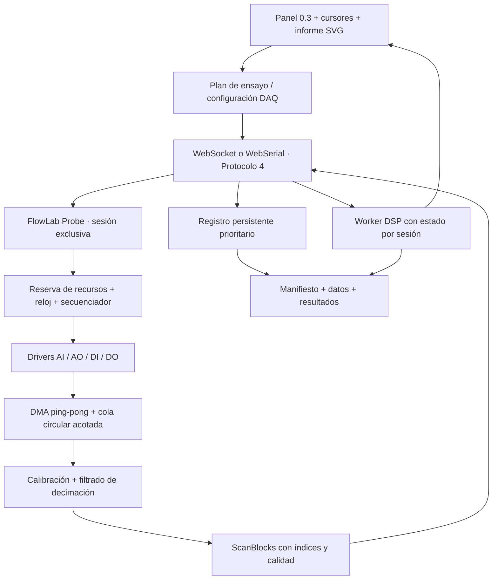

# FlowLab 0.4 — especificación técnica de metrología e instrumentación

Estado: propuesta de arquitectura, 2026-09-21. Base: FlowLab 0.3, protocolo serie 3. Este documento no anuncia funciones implementadas ni una release 0.4. DEBE expresa un requisito de aceptación; los números de rendimiento propuestos son objetivos a verificar, no prestaciones medidas.

## 1. Alcance y decisiones

0.4 añade canales DAQ calibrados, medición con cursores, informes SVG, ensayos Bode/V–I, ajuste experimental, notch, integración de waveforms y registro continuo. Reutiliza FFT radix-2, Waveform, Vector Index, estadística, gráfica XY, multímetro, subVIs y transportes de 0.3. No añade otra FFT, otro XY, otro DAC ni otro protocolo de sensores. Quedan fuera VISA, SCPI, osciloscopio de propósito general de alta frecuencia, osciladores sincronizados entre varias placas y equivalencia funcional con LabVIEW.

Decisiones fundamentales:

1. El reloj de adquisición y el secuenciador de ensayos residen en Probe. El navegador configura, procesa y visualiza; sus temporizadores nunca determinan instantes de conversión o actualización AO.
2. El motor continuo publica bloques, independientemente del `Runtime.tick()` escalar de 0.3. No se implementa el datalogger llamando repetidamente al bloque de ráfagas.
3. AI/AO son capacidades reales. Un GPIO o PWM no se presenta como AO analógico calibrado. Los perfiles de hardware concretos anuncian recursos, rangos, anchos de banda y calidad temporal.
4. “Probe cerrado” significa firmware funcionalmente fijo, distribuido en imágenes precompiladas con versión, hash y manifiesto por placa. Se conserva el código MIT y su construcción reproducible. No requiere que el alumno edite un sketch. Si se pretendiera código propietario, sería una decisión de licencia separada de esta arquitectura.
5. “Sin huecos” significa continuidad demostrable en una sesión aceptada, bajo su presupuesto de recursos. Ante pérdida, se informa y finaliza o segmenta la sesión; nunca se inventan muestras para aparentar continuidad.

## 2. Arquitectura



**Probe:** HAL por perfil, administrador exclusivo de recursos, calibración, DMA, reloj, secuenciador acotado, protocolo, watchdog y estado seguro. Sin JSON, impresión serie, NVS ni asignación dinámica en ISR. Buffers y planes se reservan antes de armar. La tarea de control sigue atendiendo ABORT y heartbeat mientras una captura está activa.

**Host Python:** un único lector serie persistente desmultiplexa respuestas, eventos y datos. Sustituye la lectura bloqueante privada de cada `_request`; un escritor serializa comandos. Una cola prioritaria atiende control, otra registra datos y otra limita la previsualización. La propiedad exclusiva y la autenticación local de 0.3 se mantienen. El registro puede continuar al cerrar la vista solo si se activó explícitamente una sesión de registro administrada por el host; por defecto, perder el propietario termina la sesión.

**WebSerial:** el mismo parser binario y contratos; DSP en Worker, colas limitadas y escritura incremental a un archivo elegido. Suspensión de pestaña/OS, cierre o pérdida del puerto interrumpen la garantía. No se promete registro desatendido si el navegador queda suspendido. El modo host es la ruta de aceptación para ensayos de 24 horas.

**Panel:** refresco 10–30 fps; puede omitir frames visuales y reducir vértices, preservando todos los datos en el registro. Un contador diferencia pérdida visual de pérdida de adquisición. El estado de filtros, ensayos y acumuladores no depende de repintar el panel.

## 3. Canales universales y calibración en origen

### 3.1 Contrato de canal

Identidad persistente: `deviceId/channelId`, por ejemplo `probe-a31/AI0`. El proyecto enlaza esta identidad con un alias como `Fuerza`. El usuario elige magnitud, rango y terminal físico del perfil; el mapeo GPIO/periférico permanece en el manifiesto del dispositivo y puede inspeccionarse para cablear.

| Tipo | Operaciones | Representación y límites |
|---|---|---|
| AI | lectura, captura finita, streaming | magnitud calibrada, unidad, calidad y procedencia |
| AO | valor fijo, waveform, secuencia | consigna física, rango, slew, estado seguro; waveform solo si se anuncia |
| DI | lectura, muestreo síncrono si existe | booleano y timestamp; no lleva calibración afín |
| DO | escritura, secuencia temporizada si existe | booleano, polaridad y estado seguro |

Cada descriptor DEBE incluir: `id`, tipo, backend, terminales, resolución nominal, límites eléctricos, rango de ingeniería, unidad y dimensión, modo diferencial/single-ended, capacidad de referencia externa, tasas admitidas, `clockDomain`, skew y latencia, capacidades `sampled`, `waveform`, `syncAI`, versión de calibración y recursos incompatibles. Una tasa corresponde a muestras/s **por canal**; se declara además el total de conversiones/s.

En S3/C3/C6 no se crea AO interno porque carecen de DAC nativo. Un módulo ADC/DAC externo puede aportar canales si tiene driver Probe y un perfil verificado. Un DAC I²C lento podría servir para consignas o V–I escalonado; no habilita Bode automáticamente. La implementación de un driver interno nuevo no supone exponer un nuevo bus genérico al usuario.

### 3.2 Transformación y unidades

Para AI, cadena inmutable durante una adquisición:

`código bruto → corrección eléctrica del ADC → x en V → y = m·x + b → valor de ingeniería`.

Se conserva por separado la calibración eléctrica del ADC y la del sensor/acondicionador. Usar eFuse o el driver de calibración no convierte por sí mismo un ADC en un instrumento calibrado de fuerza. Espressif proporciona conversión de códigos a voltaje y distintos esquemas de calibración; Probe registra cuál se empleó. [Referencia del driver](https://docs.espressif.com/projects/esp-idf/en/v5.5.1/esp32/api-reference/peripherals/adc_calibration.html).

Ejemplo: transductor 0,5–2,5 V = 0–100 N: `m=50 N/V`, `b=−25 N`; una entrada de 1,5 V produce 50 N. `°C`, `N`, `kPa` son unidades con semántica, no etiquetas libres para cálculos. La tabla mínima debe definir dimensiones, prefijos y unidades afines; una diferencia de °C se trata como intervalo térmico. Unidades personalizadas se permiten como opacas, pero bloquean operaciones dimensionales que no puedan justificarse.

Para AO: la consigna física se invierte mediante la calibración del actuador, `x=(y−b)/m`, y se transforma al código eléctrico. Se exige `m≠0`, finitud, rango, cuantización y límite de slew. Se rechaza fuera de rango por defecto; una política de saturación explícita DEBE devolver el valor aplicado y la marca `CLIPPED`. El código aplicado no se presenta como salida medida; esta requiere realimentación AI.

La calibración se aplica en Probe antes de transmitir. El host no vuelve a multiplicar un valor ya calibrado. Cálculo interno al menos float64 para coeficientes; transmisión float32 con presupuesto de redondeo registrado. Para decimación, la corrección eléctrica se aplica a las conversiones antes del filtro; una transformación afín de sensor puede aplicarse después de filtrar si conserva ganancia DC y unidades.

### 3.3 Registro de calibración

Objeto con `calId`, revisión, canal, dispositivo, sensor, unidad origen/destino, `m`, `b`, covarianza de coeficientes si existe, puntos y residuales, rango válido, condiciones, fecha, referencia y estado `factory/user/unverified/expired`. No se denomina trazable una calibración sin evidencia de su referencia. Expiración produce advertencia persistente o bloqueo según política del ensayo.

Proceso: capturar varios puntos conocidos → ajuste lineal existente en el nuevo módulo de regresión → vista previa → validación → commit explícito en IDLE. NVS con dos slots, contador de revisión, CRC y activación atómica; nunca escritura por muestra. Proyecto y registro guardan una copia y hash del perfil utilizado. Cambiar la calibración inicia otra época de adquisición; ningún bloque mezcla revisiones.

Si se conocen incertidumbres independientes de x y de los coeficientes, la incertidumbre estándar de salida admite:

`u(y)² = m²u(x)² + x²u(m)² + u(b)² + 2x·cov(m,b) + u(modelo)²`.

Si hay correlaciones adicionales se requiere la matriz completa; los términos ausentes quedan como desconocidos, no cero. La UI distingue desviación observada, incertidumbre y resolución. No se promete una exactitud universal para la familia ESP32.

## 4. Modelo de datos y motor de bloques

Se conserva `Waveform {kind, samples, dt, t0}` y límite 4096 por bloque. Para flujos sincronizados se introduce un contrato DAQ interno **ScanBlock**; nunca se acumulan 24 horas en un vector:

```json
{
  "kind": "scanblock",
  "sessionId": 17,
  "streamId": 1,
  "configRev": 4,
  "sequence": 125,
  "firstSampleIndex": "16000",
  "firstDeviceTick": "802000000",
  "clockDomain": "probe-a31:adc0",
  "rate": {"num": 2000, "den": 1},
  "scans": 128,
  "channels": ["AI0", "AI1"],
  "calibrationRevisions": [8, 3],
  "quality": "per-sample-channel",
  "timeQuality": "nominal",
  "payload": "binary"
}
```

Los enteros de 64 bits se mantienen como BigInt; al serializar JSON se representan como cadenas. `sampleIndex` no se deriva del número de paquete recibido. `configRev` referencia un descriptor inmutable con orden de canales, unidades, calibración, reloj y retardos; llega antes del primer bloque. El tick de la primera muestra procede de hardware o de una estimación con incertidumbre declarada, nunca del instante en que llega la interrupción de buffer.

Adaptadores explícitos:

- `AI canal → Waveform`: un canal calibrado con metadatos de calidad, reloj y procedencia; `dt` se obtiene de la tasa efectiva configurada. El tiempo no deriva del ciclo del diagrama.
- `ScanBlock → XY`: extrae dos columnas del **mismo bloque e índices**. No empareja los últimos valores de dos eventos independientes.
- `ScanBlock → último valor`: salida escalar para multímetro/diagrama lento; muestra antigüedad y estado. Un bloque heredado acepta el número pero no conserva metrología automáticamente.
- FFT recibe Waveform de 0.3 y su metadata. Se promueve su descriptor de espectro a resultado persistente del instrumento: `df`, `f0`, ventana, escala, referencia y procedencia; deja de depender solo de un estado efímero de dibujo.

ScanBlock y resultados de ensayo se conectan por puertos tipados dedicados, sin convertirlos implícitamente en Vector. Los bloques existentes conservan sus tipos y colores; los puertos DAQ usan una banda y etiqueta distintiva además de color. No se implementan clusters genéricos. Un subVI 0.3 puede seguir procesando una Waveform por su conector existente; los nuevos contratos no amplían silenciosamente sus firmas.

Los workers DSP son consumidores de bloques en orden. Su estado está identificado por `(sessionId, streamId, canal, bloqueDSP, parámetros)`. Reconfiguración, reinicio o discontinuidad exige política de reset explícita. El ensayo tiene un coordinador asíncrono que emite progreso y resultados; no bloquea un tick durante todo el barrido.

## 5. Tiempo y sincronización

Se mantienen tres dominios separados: reloj de muestras, reloj monotónico de dispositivo y reloj de presentación/UTC del host. Cada backend anuncia cómo relaciona los dos primeros, resolución, deriva nominal/calibrada, jitter y validez de la estimación. Un ajuste reloj-host sirve para ubicar datos en un informe, nunca para calcular fase entre canales.

Para canal c y scan k:

`t(c,k) = tStart + k/fs + skew(c) − groupDelay(c)`.

Se informa si `skew` y `groupDelay` se compensaron. El índice sigue siendo la identidad de cada scan; no se renumeran datos al corregir tiempos. Un ADC multiplexado realiza conversiones sucesivas, no simultáneas: el perfil publica separación entre canales y su incertidumbre. El alineamiento por interpolación requiere banda limitada y filtro declarado; no elimina físicamente el skew.

**AO/AI:** `PREPARE` reserva y valida todos los recursos, precarga AO, fija tasas/ratios y verifica presupuesto de CPU/memoria/enlace. `ARM` compromete todo el grupo. `START` inicia sobre un límite de reloj local programado, o trigger hardware anunciado; un solo comando prepara el inicio, sin escrituras AO y lecturas AI alternadas desde el PC. Se registra el índice exacto de inicio del estímulo y de cada segmento.

Categorías de capacidad: `hardware-shared` (reloj/trigger compartido), `hardware-rational` (relojes con relación y desfase verificados), `scheduled-characterized` (temporización medida y límites publicados), `unsynchronized` (solo lecturas/escrituras independientes). El modo Bode metrológico exige una de las dos primeras para el conjunto AO/AI; el tercero se ofrece solo como ensayo exploratorio con incertidumbre de fase. No existe una garantía por nombre de SoC.

En el ESP32 clásico, el ADC continuo usa I2S0 y el DAC continuo también puede usar ese recurso. Por ello el perfil interno **no anuncia AO+AI DMA síncronos por defecto**: requiere una implementación coexistente validada o un frontend externo con reloj/trigger adecuados. Esta es una consecuencia de las restricciones de ambos drivers. [ADC continuo](https://docs.espressif.com/projects/esp-idf/en/v5.5.1/esp32/api-reference/peripherals/adc_continuous.html), [DAC continuo](https://docs.espressif.com/projects/esp-idf/en/v5.5.1/esp32/api-reference/peripherals/dac.html).

Error de fase temporal: `uφ ≈ 360·f·uΔt` en grados. A 100 Hz, 1° requiere incertidumbre de desfase ≤27,8 µs; a 1 kHz, ≤2,78 µs. Un timestamp de USB no permite cumplir ese requisito. La especificación no incluye sincronización de varias placas por software; un futuro trigger externo requerirá perfiles y aceptación propios.

Estados: `IDLE → CONFIGURED → ARMED → RUNNING → DRAINING → COMPLETE`. Desde cualquier estado activo, `ABORTING → ABORTED` o `FAULT`. Cambios de configuración, calibración y ownership solo en IDLE/estado terminal. STOP ordenado corta en un límite de scan, drena datos y publica el último índice. ABORT prioriza salidas seguras y puede dejar un bloque parcial, que debe marcarse.

## 6. Metrología del panel y SVG

Se extienden los instrumentos existentes; no se crean osciloscopios ni FFT paralelos.

| Instrumento | Cursores | Lectura |
|---|---|---|
| Osciloscopio/Waveform | X1/X2 en tiempo; Y1/Y2 en magnitud | Δt, 1/|Δt| si Δt≠0, ΔY en unidad real |
| FFT | X1/X2 en frecuencia; Y1/Y2 en magnitud | Δf, amplitudes y ΔY; dB según referencia |
| XY | lectura de pares y selección de intervalo | coordenadas físicas, rango de ajuste |

`ΔV` se utiliza solo si Y está en voltios; para fuerza se muestra ΔN, para presión ΔkPa. En FFT el eje X es Hz: no se etiqueta Δt. Convertir frecuencia a período es una lectura derivada individual `1/f`, no una supuesta distancia temporal entre bins. Restar niveles dB solo tiene sentido con la misma referencia; `10^(ΔdB/20)` expresa razón de amplitudes para esa escala.

Interacción: arrastrar, entrada numérica y flechas; selección de traza, snap a muestra/bin o interpolación explícita. FFT conserva resolución `df`; interpolar un pico no aumenta la resolución experimental. Los cursores se anclan a coordenadas del eje y a una captura/ventana identificada; al congelar o exportar se usa un snapshot atómico. Un cursor sobre un hueco muestra “sin datos”. La presentación incluye unidades, escala, calibración, resolución temporal y estado nominal/calibrado del reloj.

SVG limpio: un generador común de geometría alimenta canvas y exportador. Elementos `path`, `text`, líneas de ejes/cursores, unidades, leyenda, Δ y título; `viewBox` estable, fondo blanco opcional, sin bitmap ni controles del editor. Se escapan etiquetas y unidades; sin scripts, enlaces externos ni `foreignObject`. Los huecos rompen paths. Fuentes genéricas y grosores legibles al imprimir. Modo por defecto exporta la selección completa sin simplificar; para trazas enormes se ofrecen páginas/ventanas. La simplificación opcional declara tolerancia y mantiene los datos originales en archivo adjunto. Cursores y estadística siempre usan datos completos.

El SVG incluye `<metadata>` con sesión, índices/intervalo, versión de algoritmo, unidades, calibración, configuración FFT/DSP, estado de pérdida y hash del segmento de datos. Exportar una imagen no equivale a exportar el conjunto experimental completo.

## 7. Automatización de ensayos

### 7.1 Plan y ejecución

Un `TestPlan` inmutable define canales, pasos, límites, tasas, establecimiento, repetición, criterio de validez y destino. El host expande la receta a una tabla finita de segmentos; Probe la valida y ejecuta localmente. No ejecuta scripts ni código suministrado por el usuario.

Límites propuestos: 256 segmentos, 4 canales AI, 2 AO donde el hardware lo permita, bloque hasta 256 scans para streaming, payload máximo 16 KiB y tabla de plan hasta 48 KiB. Son topes de protocolo; `CAPS` anuncia límites menores por perfil. Planes mayores se dividen entre ensayos terminados, no insertando comandos durante un segmento que deba ser continuo.

Cada segmento incluye `segmentId`, tipo de estímulo, canales, valor/amplitud/offset, frecuencia solicitada y admitida, scans de establecimiento, scans de medida, repeticiones, umbrales y política de fin. Todos los límites se expresan en unidades físicas. El estímulo debe caber dentro del rango eléctrico después de la inversa de calibración.

Los estados y resultados registran intento, índice de inicio/fin, saturación, errores, amplitud real, calidad temporal, calibración y datos utilizados. Un paso sin datos suficientes permanece inválido; no se rellena con el anterior. Repetir un punto crea otro intento visible. La aplicación ofrece progreso, abortar y un resultado tabular enlazado con sus capturas.

### 7.2 Bode automático

Modo recomendado: AO estímulo senoidal + `AI_ref` sobre la entrada real del dispositivo bajo ensayo + `AI_resp` en su salida. Dos AI comparten la adquisición. Con un solo AI se permite respuesta respecto a la **consigna AO**, marcada como función combinada generador+DUT+medición; no como respuesta calibrada del DUT.

Flujo por punto:

1. Elegir barrido logarítmico/lineal y frecuencia representable. DDS/LUT usa índice de hardware; el plan informa `fRequested` y `fActual`, resolución y fase inicial. Los cambios de segmento preservan o reinician fase según política explícita.
2. Establecer AO con offset y amplitud pico, rampa inicial y límites. Esperar `max(tMin, settleCycles/fActual)`; un modo adaptativo puede extender dentro de un máximo predefinido.
3. Capturar simultáneamente referencia/respuesta durante ciclos completos cuando la relación reloj lo permita. Preferencia: `fActual = k·fs/N`; si no hay coherencia entera, usar ajuste senoidal con tiempos conocidos y reportarlo. No usar el bin más cercano de FFT para estimar fase.
4. Ajustar en ambos canales `z(t)=c+a·cos(ωt)+b·sin(ωt)` con mínimos cuadrados QR. Con convención `z=Re{Z·exp(jωt)}`, el fasor es `Z=a−j·b`.
5. Calcular `H=Zresp/Zref`; `GdB=20 log10(|H|/Href)` y `φ=arg(H)`; fase negativa indica atraso bajo esta convención. Para canales de la misma magnitud, `Href=1`. Si las dimensiones difieren, se informa transferencia en unidades y se exige referencia dimensional compatible antes de expresar dB.
6. Compensar skew/retardos medidos de la cadena DAQ según perfil, conservando resultado bruto y corregido. Una calibración loopback opcional proporciona `Hcorr=H/Hloopback`, limitada a configuración, rango y frecuencias verificados.
7. Rechazar referencia bajo el umbral, clipping, muestras perdidas o mal condicionamiento; informar SNR/residual y dispersión entre repeticiones. Unwrap solo atraviesa puntos consecutivos válidos, guardando también fase envuelta.

La FFT ya existente sirve para inspeccionar armónicos/residuales. No se reimplementa ni se usa su vector de magnitudes como si contuviera fase compleja.

Límite inicial conservador: `fMax ≤ min(fsAI/20, fsAO/20, anchoBandaValidado)`. Con AI a 2 kSa/s, el barrido garantizado no supera 100 Hz. Frecuencias mayores requieren otro modo DAQ validado; el bloque burst de 0.3 por sí solo no habilita Bode síncrono a alta frecuencia. El extremo inferior se limita por tiempo de establecimiento y duración máxima del plan, no por un número arbitrario de Hz.

Resultados: tabla `{fRequested,fActual,gainDb,phaseDeg,phaseUnwrapped,refAmplitude,responseAmplitude,residual,repeatCount,quality}` más capturas y metadata. Panel Bode de dos ejes compartidos: ganancia y fase frente a frecuencia logarítmica; utiliza el mismo motor de trazas y exportación SVG.

### 7.3 Trazador V–I

AO controla la excitación; AI_V mide tensión real del DUT y AI_I mide corriente mediante shunt/acondicionador calibrado. Un GPIO no mide corriente directamente. El frontend debe especificar topología, conexión diferencial, referencia, polaridad, rangos y potencia permitida. La tensión AO solicitada no sustituye AI_V.

Dos recetas sobre el mismo secuenciador:

- **Escalonada:** AO → establecimiento → ráfaga sincronizada V/I → estadística conjunta → siguiente escalón. Guarda puntos medios, dispersión y las ráfagas. Los intervalos sin adquisición son deliberados y no se anuncian como streaming gapless.
- **Rampa continua:** AO y scan AI temporizados en el mismo grupo; conserva la trayectoria completa y sentido ascendente/descendente para histéresis. La gráfica XY recibe pares por índice de scan, con compensación explícita de skew si corresponde.

Límites: tensión, corriente, potencia estimada, energía y tiempo; si se superan, Probe aborta y aplica estado seguro. La latencia del interlock software se declara. Un límite físico rápido de corriente requiere hardware de compliance; no se promete protección inmediata de un componente mediante USB o un ADC muestreado. Resultado: tabla y trazas V–I, timestamps, dirección, rama, calibración y causa de terminación.

## 8. Procesamiento experimental

### 8.1 Regresión lineal y exponencial

Un solo bloque **Ajuste experimental**, modelos `linear` y `exponential`. Entrada: pares XY válidos de un intervalo congelado, obtenidos del instrumento/ScanBlock o de tiempo-magnitud de Waveform. Salidas: reporte de parámetros y curva ajustada; adaptadores tipados extraen parámetros numéricos si se necesitan en el diagrama.

- Lineal: `y=a·(x−xref)+b`, x centrada/escalada, resolución mediante QR. Devuelve pendiente, ordenada en xref, ordenada en cero cuando sea finita, unidades, residuales y condición. Mínimo 3 puntos, X no constante. Incertidumbres opcionales definen pesos; sin ellas, mínimos cuadrados ordinarios. Se asume error en X despreciable; no se anuncia regresión ortogonal.
- Exponencial: `y=A·exp(k·(x−xref))`, **sin offset aditivo libre en 0.4**. Para esta primera versión se exige Y>0 y al menos 4 puntos con X variable. La regresión de `ln(y)` solo inicializa; el ajuste final minimiza residuales en Y original mediante Levenberg–Marquardt acotado. Normalización, control de overflow, máximo de iteraciones y criterio de convergencia publicados; fallo de convergencia no produce parámetros válidos. A tiene unidad de Y, k unidad inversa de X.
- `R²=1−Σ(yi−ŷi)²/Σ(yi−ȳ)²` sobre Y original y los mismos puntos aceptados. Si el denominador es cero, resultado `null/indefinido`; puede ser negativo. Si hay pesos, se puede añadir R² ponderado con nombre y fórmula distintos.
- Reporte: modelo, parámetros, xref, rango, N aceptado/rechazado y motivos, R², RMSE, SSE, grados de libertad, convergencia, versión y covarianza si es estimable. Intervalos de confianza deben declarar hipótesis; R² alto no demuestra exactitud ni causalidad.

No se eliminan outliers silenciosamente. La selección/exclusión es explícita y queda en el informe. Se preserva orden de adquisición para graficar; el orden no modifica los pares empleados en el ajuste.

### 8.2 Notch de 50/60 Hz

Bloque Waveform **Notch de red**, biquad IIR de segundo orden con `f0=50|60 Hz` y Q configurable, propuesto 5–100. Tasa obtenida de la Waveform; rechaza `f0≥fs/2`, por lo que 50 Hz a 100 Sa/s y 60 Hz a 100 Sa/s son configuraciones imposibles. Regla de operación recomendada: fs≥4·f0; una tasa superior permite separar mejor transitorio y banda útil.

`ω0=2πf0/fs`, `α=sin(ω0)/(2Q)`; coeficientes sin normalizar:

`b=[1,−2cos(ω0),1]`, `a=[1+α,−2cos(ω0),1−α]`.

Dividir todos por a0; implementación float64 Direct Form II transpuesta. Estado persiste entre bloques contiguos del mismo flujo. Reset al cambiar parámetros, fs o época; no reiniciar cada paquete. Un hueco invalida continuidad y marca el transitorio de reinicialización. Unidad y dt permanecen, pero se añade historial de procesamiento y retardo dependiente de frecuencia. No es fase cero; no se aplica por defecto a Bode ni a su referencia. Filtrado hacia adelante/atrás queda fuera del streaming 0.4.

### 8.3 Integrador de Waveforms

Integra con regla trapezoidal y condición inicial configurada:

`I[n]=I[n−1]+(y[n−1]+y[n])·dt/2`.

Conserva última muestra e integral entre bloques, sin duplicar ni omitir el intervalo de frontera. Primer resultado de la sesión es I0; en el siguiente bloque se integra desde la última muestra anterior hasta la primera nueva. Salida Waveform con misma malla y unidad `unidadEntrada·s` (N·s, A·s, etc.). Para unidades afines como °C se exige conversión a Kelvin o magnitud de diferencia respecto a una referencia explícita.

Opciones: offset fijo validado/resta de línea base medida antes de adquirir, reset, saturación explícita con marca y reinicio por trigger. No se resta la media de cada chunk: cambiaría el resultado según el empaquetado. Un hueco invalida la integral absoluta; política por defecto termina el segmento y exige nuevo I0. Nunca integra a través de muestras ausentes. La deriva por offset se muestra y queda documentada.

## 9. Streaming continuo y datalogger

### 9.1 Tasas y buffers

Objetivo inicial: 100–2000 Sa/s por AI, de 1 a 4 canales según perfil y transporte. Tasas obligatorias a caracterizar por perfil: 100, 200, 250, 500, 1000 y 2000; cualquier tasa adicional debe ser anunciada. La aceptación devuelve tasa racional efectiva, ancho de banda y filtro; no se redondea sin informar.

El ADC interno puede requerir una tasa de conversiones mayor que la tasa de salida. Probe obtiene los límites del driver/SoC y elige sobre-muestreo y decimación con filtro antialias. No se presupone que el ADC DMA acepte directamente 100 Hz. La frecuencia agregada es la suma de conversiones de canales activos; no se confunde con fs por canal. Filtro de decimación propuesto: FIR polifásico con banda útil hasta 0,4·fsSalida y rechazo ≥60 dB desde 0,5·fsSalida, solo donde los recursos lo permitan. El filtro analógico previo sigue siendo necesario para evitar alias en el ADC original.

Ruta: periférico continuo → buffers DMA A/B alternados → tarea de adquisición → corrección eléctrica/decimación/calibración → ring de ScanBlocks → transmisor. Los dos buffers evitan parar al intercambiar productor y consumidor; **no absorben pausas ilimitadas**. La ring adicional absorbe jitter de transporte. DMA usa memoria compatible con el periférico; PSRAM, si existe, no se presupone válida para DMA directo.

Bloques de 16–256 scans, elegidos para ~20–100 ms de latencia cuando la tasa lo permite. Ejemplo 2 kSa/s, 128 scans: 64 ms por bloque. A 100 Sa/s, 16 scans: 160 ms; el panel informa esa latencia. `bufferRetentionMs` se calcula con la memoria realmente reservada y se anuncia.

Tamaño mínimo de la cola útil: `bytesPerScan·fs·maxTransportStall + margen`; además se reserva pool DMA, estado DSP y memoria de control. Ejemplo 2 AI, 2 kSa/s, f32+u16 de calidad: 24 kB/s; 32 KiB de ring cubren aproximadamente 1,36 s antes de considerar cabeceras/margen. La reserva se valida durante PREPARE, nunca con un fallo de malloc en medio del ensayo.

### 9.2 Presupuesto de enlace

Protocolo 4 binario, tupla normal de 6 bytes por canal y scan: float32 físico + uint16 calidad. Opción auditada de código bruto uint16: 8 bytes por canal y scan; si hubo decimación, los códigos fuente completos se registran como stream bruto separado, no como un supuesto único código de la muestra filtrada.

| AI a 2 kSa/s | Payload normal | UART 115200, 8N1 | UART 921600, 8N1 |
|---|---:|---|---|
| 1 | 12 kB/s | no cabe | candidato |
| 2 | 24 kB/s | no cabe | candidato |
| 4 | 48 kB/s | no cabe | candidato |

115200/10=11520 B/s y 921600/10=92160 B/s antes de framing. Se exige uso sostenido ≤70 % del caudal medido, incluyendo COBS, cabeceras, calidad, eventos y control. Cuatro AI con bruto serían 64 kB/s antes de overhead y ya pueden superar ese margen; se reduce tasa/canales o se usa USB CDC con caudal validado. No se admite una sesión solo porque la fórmula teórica del UART parezca suficiente.

Para UART, negociar mayor baud exclusivamente en IDLE mediante procedimiento con ACK a la velocidad antigua, cambio acordado y handshake a la nueva. Si no se completa en plazo, Probe restaura 115200 y modo legado. En USB CDC, line coding no demuestra caudal: se mide el transporte y no se reinicia el dispositivo si el perfil no permite hacerlo sin reset.

### 9.3 Integridad, presión de cola y almacenamiento

- Cada bloque lleva secuencia, índice absoluto, configuración y CRC. El receptor distingue duplicados, corrupción, reinicio y hueco de muestras; índices crecientes sin repetición dentro de una época.
- Los créditos del host regulan transmisión, no detienen el reloj ADC. Sin créditos, la ring sigue llenándose. Si no queda espacio, política normal `FAULT_OVERFLOW`, AO/DO seguros y fin inválido; `allow-gaps` opcional abre un segmento discontinuo y enumera las pérdidas. Si el hardware no permite saber cuántas conversiones se perdieron, la cantidad se marca desconocida y se cambia de época.
- Un crédito significa capacidad de ingestión, no confirmación de escritura durable. Un ACK de registro independiente comunica el último índice persistido. Perder un frame no implica retransmitir una salida física; reanudación de adquisición nunca es automática.
- El registro va antes de la reducción para pantalla. Directorio elegido por el usuario, manifiesto JSON y chunks binarios inmutables con CRC/hash, más journal append-only e índice de segmentos. Archivos temporales, cierre/renombrado y checkpoints de durabilidad configurables. Recuperación conserva hasta el último bloque completo válido y marca final no limpio. Proyecto/calibraciones se guardan junto al registro; nada depende de localStorage.
- `flush`/`fsync` y semántica de navegador se documentan por backend; el informe distingue datos recibidos de persistidos. Una escritura asíncrona no se anuncia como protección contra corte eléctrico.
- Rotación por tamaño/duración, espacio libre mínimo, límites de cola y alarma de disco lento/lleno. No hay borrado circular de ensayos por defecto. CSV se genera desde los chunks al exportar, con índices, tiempos, unidades y calidad; no se usa como almacenamiento primario de alta tasa.
- Estimación: dos AI a 2 kSa/s, 6 bytes/canal, 24 h ≈2,07 GB de payload; cuatro AI ≈4,15 GB, más framing, índices, metadata y posibles datos brutos.

## 10. Protocolo 4

### 10.1 Negociación sin romper clientes 0.3

**Probe arranca en modo legado:** 115200, ASCII/LF, comandos y semántica del protocolo 3, sin frames espontáneos. `hello` conserva `protocol:3`, porque el cliente 0.3 rechaza otro número y compara igualdad para DAC/Touch/PCNT/Tone. Añade campos que el cliente viejo puede ignorar:

```json
{"id":1,"ok":true,"value":{"protocol":3,"family":"esp32s3","firmware":"FlowLab Probe 0.4","supportedProtocols":[3,4],"capabilities":["p4-negotiate"],"watchdogMs":2000}}
```

El ejemplo muestra negociación; las capacidades y campos históricos reales también se conservan. `protocol` describe el modo activo, no la versión máxima del firmware. El `protocol:2` actual del ACK de autenticación WebSocket pertenece al sobre del servicio host, no al firmware; 0.4 debe separarlos con nombres `hostApiVersion` y `deviceProtocol`.

El cliente 0.4, después de STOP y comprobación IDLE, envía ASCII `2 p4 1 0` (revisión de framing 1, código de baud 0=conservar). Solo si `p4-negotiate` existe. Códigos adicionales 1=460800, 2=921600 se aceptan si el perfil los anuncia. Respuesta JSON heredada con token de negociación, baud, `switchDelayMs=100` y `confirmTimeoutMs=2000`; se drena TX antes de cambiar framing/baud. El cliente pausa escritores, consume esa línea y en el límite acordado cambia a COBS binario. Envía `SESSION_OPEN` con token; Probe responde en P4 con `sessionId` y descriptor. No empieza adquisición durante la negociación.

Ante timeout o token inválido: descartar bytes pendientes, estado seguro, 115200, parser ASCII y requerir nuevo `hello`. En P4 no se intercalan líneas ASCII ni logs de diagnóstico. Un cliente antiguo conectado a una sesión P4 anterior requerirá cerrar/reabrir tras expirar la sesión o reset; no se auto-detecta ASCII dentro de datos binarios.

Cliente 0.4 + firmware 1/2/3 sin capacidad P4: mantiene todas las funciones 0.3 disponibles y deshabilita DAQ/ensayos continuos con motivo. Cliente 0.3 + Probe: trabaja exclusivamente en protocolo 3. Ningún cambio de JSON escalar, `adc` raw, waveform burst o STOP legado. AO calibrado solo existe mediante comandos P4; el viejo `dac` sigue recibiendo códigos.

### 10.2 Framing binario normativo

Serie: `COBS(cabecera + payload + CRC32C) + 0x00`. Enteros y float32 little-endian, sin padding implícito. Cabecera fija de **52 bytes**:

| Offset | Campo | Tipo |
|---:|---|---|
| 0 | magic, bytes ASCII `FLP4` | 4 bytes |
| 4 | framingVersion=1 | u8 |
| 5 | kind: COMMAND=1, RESPONSE=2, DATA=3, EVENT=4 | u8 |
| 6 | flags | u16 |
| 8 | payloadLength, máximo 16384 | u32 |
| 12 | requestId; 0 para datos/eventos | u32 |
| 16 | sessionId; 0 solo durante SESSION_OPEN | u32 |
| 20 | streamId; 0 para control no asociado | u32 |
| 24 | configRev; 0 si no aplica | u32 |
| 28 | sequence de DATA/EVENT; 0 para comandos/respuestas | u32 |
| 32 | firstSampleIndex; 0 si no aplica | u64 |
| 40 | firstDeviceTick; 0 si no aplica | u64 |
| 48 | scans; 0 si no aplica | u16 |
| 50 | channels; 0 si no aplica | u8 |
| 51 | encoding: 0=JSON, 1=ENG32Q16, 2=ENG32Q16RAW16 | u8 |

CRC32C de cabecera+payload, polinomio reflejado `0x82F63B78`, init/final XOR `0xFFFFFFFF`, trailer u32 LE. Longitud sin COBS: `52+payloadLength+4`. Se rechaza todo desajuste antes de reservar memoria. Se limita una unidad COBS recibida a 16512 bytes incluyendo delimitador; al exceder se descarta hasta el siguiente cero. Magic/version/CRC se comprueban antes de ejecutar un comando.

Flags v1: bit0 `END_STREAM`, bit1 `DISCONTINUITY_BEFORE`, bit2 `PARTIAL`, bit3 `ESTIMATED_TIME`; demás bits reservados, emisor los pone a cero. Configuración temporal detallada vive en el descriptor. Una cantidad desconocida se expresa como `null` en evento/descriptor, nunca confundida con cero.

COMMAND/RESPONSE/EVENT: JSON UTF-8 estricto dentro del payload, profundidad máxima 8, límites por operación, sin NaN/Infinity, claves requeridas y `additionalProperties:false` por revisión. COMMAND `{op,args}`; RESPONSE `{ok,value}` o `{ok:false,error:{code,message,details}}`; EVENT `{event,...}`. No se repite `id` dentro del payload: manda `requestId` de cabecera.

DATA: scans en orden; por cada scan, canales en el orden del descriptor, tuplas `(valor f32, calidad u16[,raw u16])`. DI ocupa valor 0/1 y queda tipado como DI en descriptor. Raw no aplica a DI ni a datos agregados sin correspondencia 1:1; se omite encoding 2 para esos streams. Bits de calidad: 0 `INVALID`, 1 `CLIPPED`, 2 `OVERRANGE`, 3 `UNCALIBRATED`, 4 `FILTER_WARMUP`, 5 `INTERLOCK`. Valor inválido se transporta como 0 con bit INVALID y se expone como ausencia; no se convierte a una Waveform numérica válida silenciosamente. Un hueco de adquisición se expresa por índices/eventos, no llenando tuplas con ceros.

WebSocket: mantiene control de sesión autenticado en mensajes de texto del host; transmite cada paquete P4 decodificado en un mensaje binario, con su cabecera y CRC, sin COBS. El host devuelve respuestas por requestId y asocia eventos de dispositivo. No recodifica cada muestra como JSON. WebSerial usa directamente el framing serie. Ambos generan el mismo ScanBlock validado.

### 10.3 Catálogo de comandos

Los nombres siguientes pertenecen al payload P4, no son nuevos comandos libres de la consola ASCII. Todos exigen sesión propietaria salvo SESSION_OPEN. CAPS detalla capacidades y límites efectivos; el éxito de PREPARE confirma una combinación concreta.

| `op` | Argumentos esenciales | Respuesta / efecto |
|---|---|---|
| `SESSION_OPEN` | token negociación, clientVersion | sessionId, deviceId, bootId, descriptor inicial |
| `SESSION_CLOSE` | sessionId | aplica estado seguro, termina streams, ACK, vuelve a legado tras drenar |
| `CAPS_GET` | — | canales, tasas, relojes, recursos, perfiles de sincronía, memoria y transporte |
| `TIME_SYNC` | hostSendTime, nonce | deviceRxTick, deviceTxTick, clock descriptor; host añade receiveTime |
| `STATUS_GET` | — | estado, plan/stream, último índice, colas, drops, lease y error latched |
| `CHANNEL_CONFIG` | expectedRev, channelId, rangeId, calRev, safeValue, slew | nueva configRev; solo IDLE |
| `CAL_GET` | channelId, revision opcional | registro completo de calibración |
| `CAL_STAGE` | channelId, expectedRev, registro | stagedId, hash, validación; no persistente todavía |
| `CAL_COMMIT` | stagedId, hash, expectedRev | calRev nueva y estado NVS; solo IDLE |
| `DAQ_READ` | channelIds | lectura calibrada y tiempo/calidad; rechaza recursos ocupados |
| `DAQ_WRITE` | channelId, valor físico, expectedRev | valor cuantizado aplicado y calidad; solo AO/DO sin reservar |
| `STREAM_CONFIG` | channels, rate num/den, blockScans, encoding, lossPolicy | configuración admitida, tasa efectiva, memoria, caudal, streamId |
| `PLAN_BEGIN` | testId, recipe, totalBytes, SHA256 | planUploadId; reserva tabla, no acciona hardware |
| `PLAN_CHUNK` | planUploadId, offset, datos de segmentos | rango recibido; sin traslapes distintos ni sobrepasar límite |
| `PLAN_COMMIT` | planUploadId, SHA256 | planId, revisión y resumen validado |
| `PREPARE` | planId o streamId, configRev, maxStallMs | reserva atómica; recursos, tasas/skews, ventana de crédito y hash admitidos |
| `ARM` | preparedId, hash admitido, triggerSpec | armedId; salidas aún seguras, buffers precargados |
| `START` | armedId, startSpec | instante/trigger aceptado; no significa captura terminada |
| `STREAM_CREDIT` | streamId, cumulativeGrantedBytes | límite acumulado de bytes DATA que se permite transmitir |
| `RECORD_ACK` | streamId, lastDurableSampleIndex | actualiza información de persistencia host, sin accionar hardware |
| `KEEPALIVE` | sessionId, counter | renueva lease, devuelve estado; independiente de tráfico de datos |
| `STOP` | scope, reason | corte ordenado y evento COMPLETE con índices finales |
| `ABORT` | scope, reason | cancelación prioritaria y estado seguro; evento ABORTED |
| `FAULT_CLEAR` | faultId | rearma solo en estado seguro; no reejecuta el plan |

`START.startSpec`: inmediato sobre próximo límite preparado, tick local futuro con anticipación mínima declarada o trigger externo si existe; nunca un timestamp UTC del navegador. `PLAN_CHUNK` codifica una porción del documento del plan como base64 dentro del JSON y su longitud decodificada está acotada; 48 KiB se transfieren en varias partes sin exceder payload. SHA-256 se calcula sobre los bytes UTF-8 exactos reconstruidos, antes de parsear: Probe no reserializa JSON para comprobarlo. El documento exige números finitos, esquema validado y ninguna clave duplicada. PLAN_COMMIT solo tiene éxito cuando llegaron todos los bytes y el hash coincide. El plan referencia la configuración de stream; PREPARE devuelve los streamId definitivos antes de ARM. Se puede definir un blob binario en otra revisión, no inferirlo en v1.

Créditos: `cumulativeGrantedBytes` es u64 decimal en JSON, monotónico por stream; resta los bytes de DATA **decodificados completos** (cabecera+payload+CRC). Repetir el mismo límite no duplica crédito. El host solo incrementa tras liberar espacio real en su cola. Respuestas y eventos tienen reserva de transporte independiente y no consumen crédito DATA. Se limita el frame de datos en vuelo y el tamaño de bloques según latencia de control admitida.

Eventos obligatorios: `CONFIG_DESCRIPTOR`, `ARMED`, `STARTED`, `SEGMENT_STARTED`, `SEGMENT_ENDED`, `PROGRESS`, `GAP`, `OVERFLOW`, `INTERLOCK`, `COMPLETE`, `ABORTED`, `FAULT`. `GAP` identifica stream, primer índice perdido y cantidad o `unknown`; COMPLETE incluye esperadas/producidas/transmitidas, último índice, discontinuidades y resultado. No usar “COMPLETE válido” si el host todavía no confirmó que el registro está completo: el cierre de archivo es otra etapa.

### 10.4 Concurrencia, errores y parada

Límite inicial: 8 comandos pendientes y un plan/stream activo por grupo DAQ. `requestId` aumenta por sesión; resultado terminal de los últimos 32 comandos cacheado. Duplicado con mismo ID y mismo payload devuelve resultado/estado anterior; mismo ID con payload distinto produce `ID_CONFLICT`; ID antiguo fuera de caché produce `STALE_REQUEST`, nunca vuelve a accionar. Para una respuesta perdida, consultar STATUS; el cliente no crea otro START con ID nuevo automáticamente. ID se agota antes de envolver y exige nueva sesión. Secuencia DATA usa aritmética modular u32; índice u64 y bootId detectan reinicios.

Errores estables: `UNSUPPORTED`, `BAD_ARGUMENT`, `INVALID_STATE`, `BUSY_RESOURCE`, `CAL_REV_MISMATCH`, `OUT_OF_RANGE`, `RATE_UNSUPPORTED`, `BANDWIDTH_EXCEEDED`, `BUFFER_BUDGET`, `SYNC_UNAVAILABLE`, `CLOCK_UNQUALIFIED`, `TRIGGER_TIMEOUT`, `OVERFLOW`, `INTERLOCK`, `LEASE_EXPIRED`, `ID_CONFLICT`, `STALE_REQUEST`, `CRC_ERROR`. Un frame con CRC inválido no ejecuta nada ni confía en su requestId; contabiliza error y espera resincronización.

Lease predeterminada: 2 s; heartbeat cada 500 ms, atendido por tarea de control. El caudal DATA y el ping WebSocket no renuevan la lease de dispositivo. Al expirar: interrumpir plan, AO/DO a `safeValue` declarado, latch de fallo y desarme. El heartbeat puede ser responsabilidad explícita del host para registro desatendido; en WebSerial depende del cliente y su worker.

ABORT y STOP no esperan una ráfaga de varios segundos como en el modo 0.3. Objetivo inicial de parada por ABORT: ≤20 ms desde recepción y validación completa del comando hasta salida segura para perfiles admitidos; tiempo de transporte y respuesta física del actuador se reportan aparte. La planificación de bloques/TX no debe monopolizar control. Interlock físico puede ser más rápido y necesita hardware propio. Un fallo de CPU requiere watchdog hardware y estado eléctrico de reset definido en el perfil; el software no garantiza por sí solo el estado de una carga durante reset.

## 11. Retrocompatibilidad de proyectos y código

| Cliente | Dispositivo | Resultado |
|---|---|---|
| 0.3 | Bridge 0.3 | comportamiento existente |
| 0.3 | Probe 0.4 | modo ASCII/protocolo 3 completo, sin eventos no solicitados |
| 0.4 | Bridge 0.1–0.3 | funciones heredadas según protocolo, sin DAQ P4 |
| 0.4 | Probe 0.4 | negociación explícita P4 y capacidades admitidas |

Proyectos 0.3 abren sin migración destructiva ni cambio de unidades/calibración. Se mantienen identificadores de bloques y resultados de los ejemplos. Guardar un proyecto con DAQ/metrología 0.4 crea esquema de proyecto v2 con `minAppVersion`, contratos, bindings y referencias de calibración. El parser 0.3 debe rechazar v2 por versión antes de interpretar nodos; esto se verifica contra su código real en pruebas de compatibilidad. Exportar a v1 solo se ofrece si todo el grafo y propiedades son representables, indicando qué metadata no se conserva. No se prometen proyectos nuevos legibles por clientes viejos.

DAQ P4 y ensayos no se exportan como sketches autónomos de usuario: residen en Probe. El generador 0.3 sigue exportando sus bloques admitidos; rechaza los nuevos con motivo explícito. Cargar un proyecto nunca escribe NVS ni activa AO automáticamente.

Cambios previstos en código:

| Módulo | Evolución |
|---|---|
| `firmware/FlowLabProbe/` | HAL, recursos, calibración, reloj, DMA/ring, secuenciador, protocolo y watchdog; fachada heredada |
| `firmware/FlowLabBridge/` | conservar referencia reproducible 0.3 y fixtures del protocolo |
| `boards.json` + generador | separar perfil de SoC de perfil de placa/frontend y capacidades de medición |
| `server.py` / `ws_service.py` | lector serie persistente, dispatcher, streaming binario, registro y ownership |
| `web/transports.mjs` | negociación y eventos; conservar interfaz command heredada |
| `web/protocol4.mjs`, `protocol4.py` | codecs y validación con los mismos vectores de conformidad |
| `web/data.mjs` | contratos DAQ, calidad y adaptadores sin romper Waveform |
| `web/core.mjs` | bloques nuevos acotados y coordinador asíncrono de ensayos |
| `web/signals.mjs` + Worker | regresión, notch e integral por bloques; reutilizar FFT y estadísticas |
| panel/renderer SVG | cursores, selección de datos y geometría común para gráficos existentes |
| `web/project-store.mjs` | proyecto v2 y referencias; archivos de registro a cargo de otro servicio |

## 12. Criterios de aceptación y orden de entrega

1. **Contratos y compatibilidad:** golden files de protocolos 1/2/3 y matriz cliente/firmware. Misma salida de los ejemplos 0.3. Parsers JS/Python/C++ verifican los mismos bytes P4, CRC, fragmentación, concatenación, límites, reinicios y negociación fallida. Fuzzing de longitudes/JSON sin escrituras físicas.
2. **Calibración:** transformación e inversa contra valores conocidos, unidades afines, revisiones, rangos, incertidumbre faltante y pérdida de energía durante commit NVS. Ningún ajuste se aplica dos veces. Descripción de terminales y safeValue verificada por perfil.
3. **Adquisición:** señales conocidas a 100/200/250/500/1000/2000 Sa/s, 1–4 AI admitidos, pruebas de 24 h en Windows/Linux. Cero índices ausentes/repetidos, CRC válidos y número esperado de scans. Memoria acotada; se mide caudal, drift, jitter, skew y latencia efectiva. Se inyectan pausas de host, disco lento/lleno, corrupción, desconexión y overflow: se exige gap/fallo visible, no continuidad falsa.
4. **DSP:** notch frente a respuesta analítica y ruido de prueba; integral de constante/rampa/seno y equivalencia entre particiones 16/128/256; ajustes con parámetros conocidos, ruido, X constante, Y constante, overflow y no convergencia. Algoritmos invariantes a cómo se trocean los bloques contiguos.
5. **Ensayos:** loopback Bode y red RC de parámetros caracterizados; resistor conocido y componente no lineal para V–I, con referencia externa. Criterio de fase combina incertidumbre temporal y repetibilidad; no se inventa tolerancia universal para ADC/DAC internos. Pruebas de amplitud inválida, clipping, referencia ausente, inversión de polaridad y skew.
6. **Parada:** medir ABORT, lease, fallo de tarea, reset y desconexión con AO activo; comprobar safeValue y que ningún timeout reejecuta START. Medir interlock bajo carga de transmisión y escritura de disco.
7. **Panel/informe:** cursores sobre muestras/bin/intervalos faltantes, FFT en Hz, ejes y unidades correctos, snapshot coherente durante streaming, SVG vectorial sin clipping ni contenido ejecutable, y vínculo reproducible con los datos completos.

Orden de implementación: **P4 + canales/calibración → streaming y registro → cursores/SVG y DSP → V–I escalonado → Bode y rampa V–I con perfil AO/AI verificado**. Los ensayos síncronos se habilitan únicamente al pasar su aceptación de hardware. Compilar para cinco SoC sigue siendo necesario, pero no habilita automáticamente capacidades metrológicas no caracterizadas.
